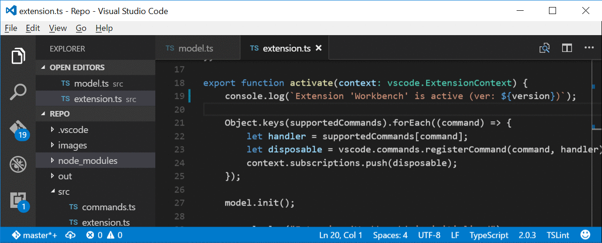
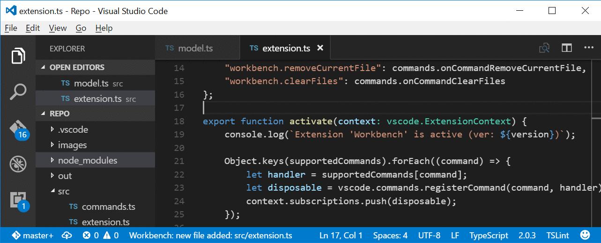

# Workbench - the VSCode Extension

Group favorite files into a workbench!

The purpose of this extension is to be a small helper that collects all your favorite files 
together (into a workbench) and provides an easy navigation between them. 

This is a beta version. Please read the roadmap and raise an issue if you see how this extension can be 
made better!

## Usage

Mark a file as favorite from the Command Palette or editor’s Title Menu.

Browse favorite files with a `Alt+Q` shortcut (type to filter by alias):

To rename an alias of a favorite file:

* Open the config file (command: `Workbench: Open Config`)
* Edit the alias manually
* Reload the config file (command: `Workbench: Reload Config`)

## Features

* Adding a file to the workbench (command: `Workbench: Add File`)
  * As a relative path
  * Duplicates are rejected
  * Parent directory name used as prefix (can be disabled through configuration `foxWorkbench.prefixAliasWithDirName`)
* Listing files from a workbench (i.e. browsing favorites)
  * Command: `Workbench: List Files`
  * Shortcut: `Alt+Q` (works in the editor and on explorer)
  * An alias is created with a prefix number
  * The list is sorted by alias
* Open all favorite files
  * Command: `Workbench: Open All Files`
* Removing an opened file from the workbench (command: `Workbench: Remove Current File`)
* Removing chosen file from the workbench (command: `Workbench: Remove Chosen File`)
* Removing all files (i.e. clearing the workbench) (command: `Workbench: Clear All Files`)
  * With confirmation dialog
* Data are stored as an easily accessible JSON file (config)
  * Location: `./.vscode/workbench.json`
* Reloading the config file
  * Command: `Workbench: Reload Config`
* Opening the config file for edit
  * Command: `Workbench: Open Config`
  * File is not reloaded automatically, use `Workbench: Reload Config` command

## Development Notes

* TypeScript 2 is used
* Promises are handled with `await` operator

## Roadmap

* External editions of storage file (`workbench.json`) should trigger a reload of in-memory data
* Editing file aliases 
* [Epic] Switch between multiple workbenches 

## Known Issues

* *Editing an alias requires triggering a config reload* File aliases can be renamed to anything by 
editing the `workbench.json` file and invoking `Workbench: Reload Config`. 
There are features on the roadmap to enable automatic reloads and allow alias editing from a command.
